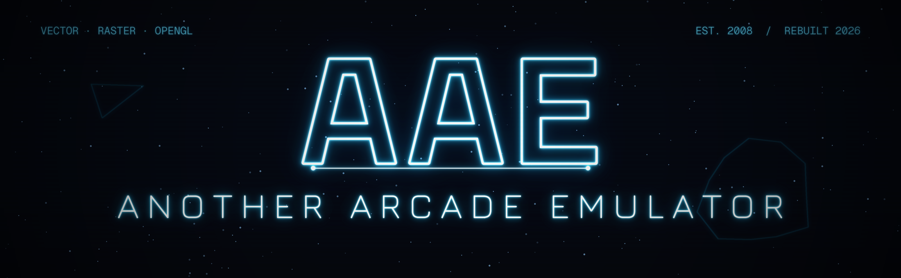
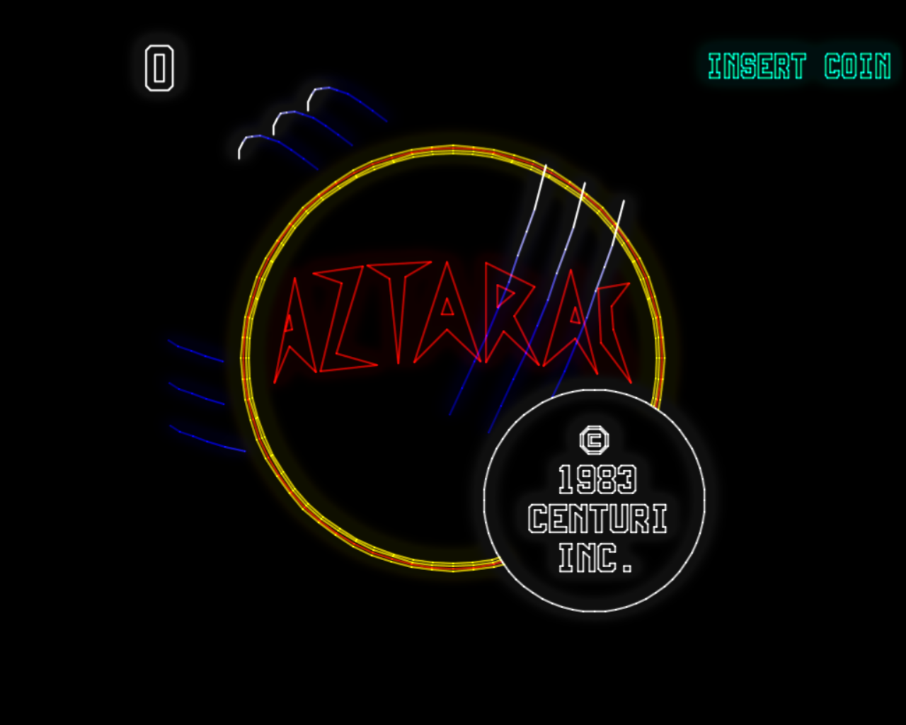
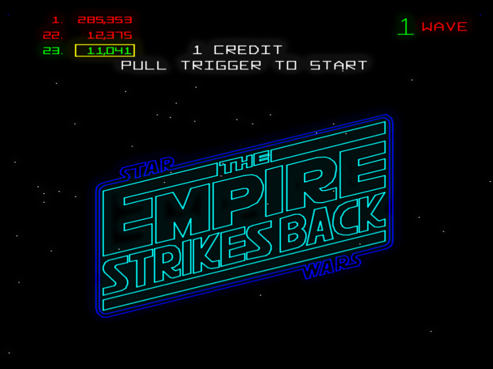
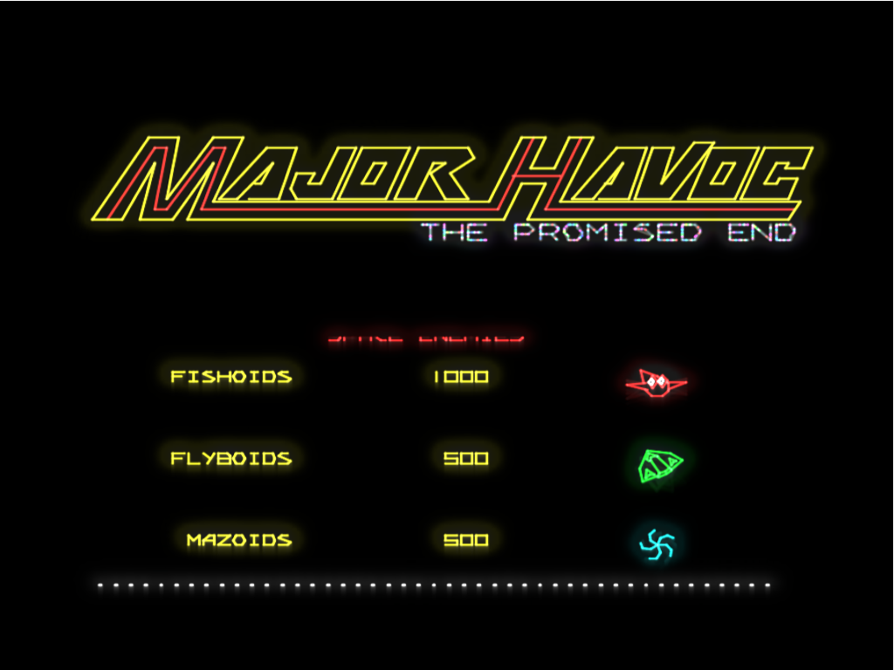
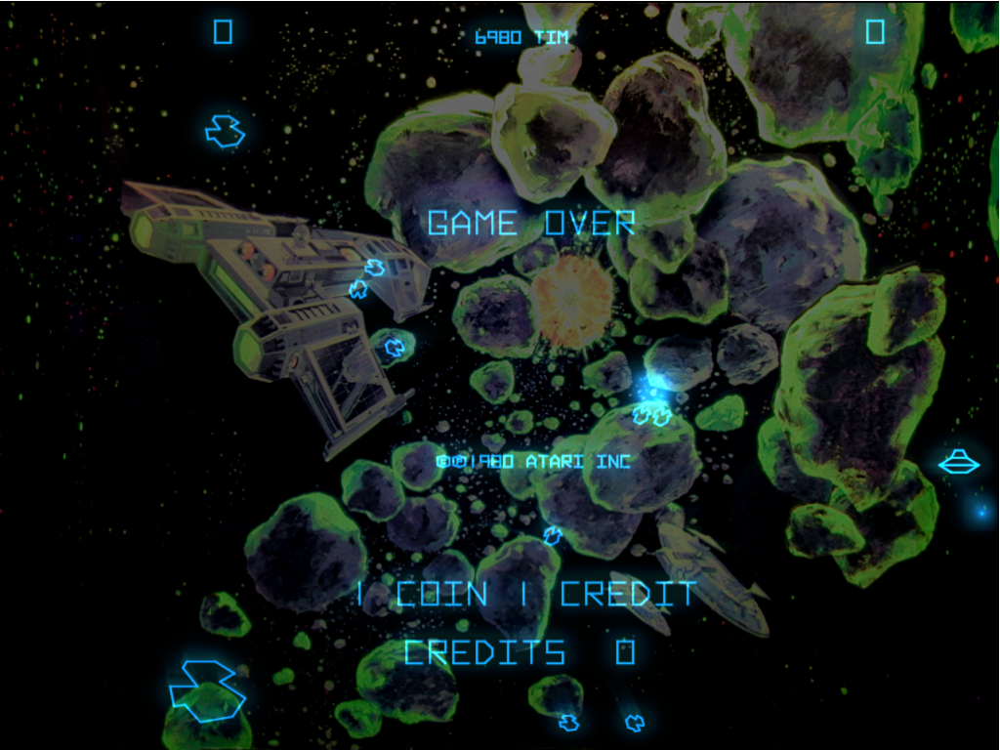
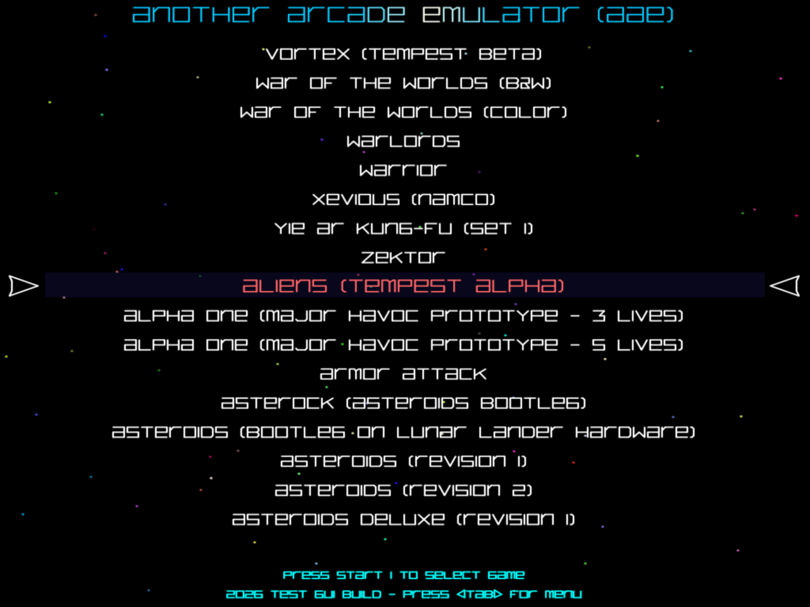
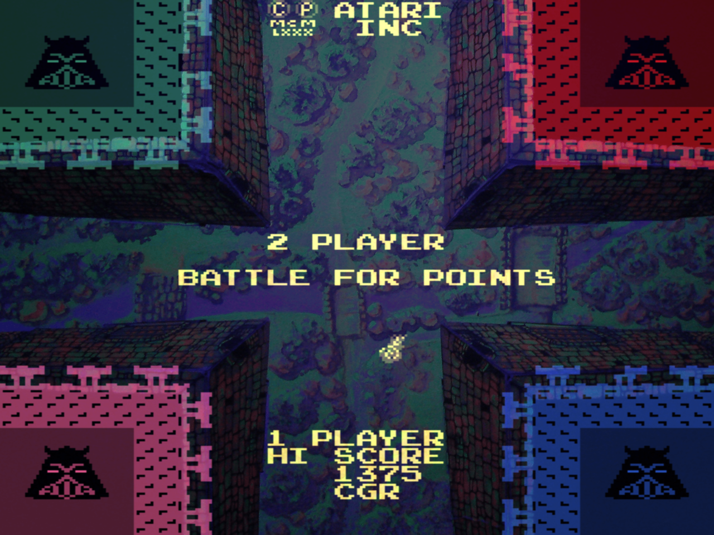

  

<h1 align="center">AAE — Another Arcade Emulator</h1>

  A phosphor-accurate emulator for classic <b>vector</b> arcade games — started in 2008,
  dragged back from the grave, and rebuilt from the ground up.

  
  
  
  
  
  

  
  

  
  

---

> ⚠️ **ROMs are not included.** You must supply your own legally-obtained arcade ROMs.
> AAE uses current **MAME (TM)** ROM names.

## About

AAE began in **2008** as an unapologetic **M.A.M.E (TM) derivative** — a poorly written fork of
early MAME (0.29 through .90) mixed with code of my own, built solely for my own amusement and
learning, and offered here only as an archival experience. The whole point was to make **vector
arcade games look *right*** — glowing, phosphor-soft beams instead of flat lines. After sitting
untouched for the better part of 17 years, it's back, and it's been rebuilt almost beyond
recognition.

The audio engine, input, frame timing, rendering pipeline, ROM loader, artwork handling, memory
handling, the back-end driver registry — and, one by one, **every CPU core** — have been rewritten
as custom, non-MAME code. The milestone I'm proudest of:

> **I have now removed ALL MAME CPU cores from my "MAME clone" emulator except for ONE.**
> The last MAME CPU core in my code is the **Cinematronics `ccpu` core by Aaron Giles** —
> and that is a work of art that will never be replaced.

Make no mistake: at its core this is still a MAME derivative, and it stands entirely on the
shoulders of the MAME team's work. **All MAME code used (and abused) in this emulator remains the
copyright of the dedicated people who spend countless hours creating it** — see
[Acknowledgements](#acknowledgements). But the climb from "early-MAME fork" to "almost everything
here is mine now" has been the entire journey.

  

> ⚠️ **Mid-renovation.** This code is undergoing a complete overhaul and some command-line options
> are temporarily broken. See [CHANGELOG.txt](CHANGELOG.txt) — the full revival diary.

## Features

- 🟢 **Phosphor vector glow** — bloom, beam falloff, and per-vector intensity rendered through an
  OpenGL 3.3 core shader pipeline, tuned to look like the real CRT on a modern OLED.
- 🎛️ **Live graphics tuning** — per-game knobs for glow, line width, and intensity.
- 🕹️ **Vector-first accuracy** — Atari AVG/DVG and Cinematronics hardware are the focus and the
  most carefully emulated.
- 🎮 **Keyboard + gamepad** — full XInput controller support including menu/GUI navigation and rumble.
- 🔊 **Custom multithreaded XAudio2 engine** — stereo streaming, high-quality resampling and
  filters, no crackle and no leaks.
- 🖼️ **MAME-style `.lay` artwork** — bezels, overlays, and scanlines for the raster games.
- 🗂️ **C++ driver registry** — add or remove a game by adding or removing a single driver, no
  `driver.c` editing required.
- 🪟 **Windows 10/11**, plus a tested **Windows 7 x64** build.

## Emulated games

**Vector games are the whole reason AAE exists.** Atari and Cinematronics vector classics —
Asteroids & Asteroids Deluxe, Tempest, Major Havoc, Battlezone, Red Baron, Gravitar, Space Duel,
Black Widow, Lunar Lander, Star Wars & The Empire Strikes Back, Aztarac, Cosmic Chasm, Star Castle,
Rip Off, Armor Attack, Warrior, Omega Race, Solar Quest, War of the Worlds, and many more.

### …and a few non-vector games, just for fun

Somewhere along the way the renderer grew a raster path, so a handful of **raster (non-vector)
games came along for the ride** — purely for fun, not the mission. Things like **Warlords,
Galaxian, Galaga, Bosconian, Pac-Man / Ms. / Jr. / Super Pac-Man, Millipede, Centipede,
Missile Command, Mappy, Dig Dug, Rally-X, Gyruss, Phoenix / Pleiads, Xevious** and Space Invaders,
complete with current MAME `.lay` artwork.

  

The full, current list of supported romsets (100+) is available right inside the app — open the
in-app game menu to browse everything AAE currently runs.

## Building

> ROMs and BIOS files are **not** included — supply your own.

**Requirements:** **Visual Studio 2022** with the *Desktop development with C++* workload (MSVC v143
toolset) and the **XAudio2 redistributable** NuGet package
(`Microsoft.XAudio2.Redist`, version 2.9 — `Microsoft.XAudio2.Redist.1.2.11`).
[How to install the NuGet package.](https://learn.microsoft.com/en-us/windows/win32/xaudio2/xaudio2-redistributable)

Open **`aae.sln`** in Visual Studio 2022, choose the **Release | x64** configuration, and build.
The executable is produced at `x64\Release\aae.exe`.

> **Legacy build:** older revisions linked against **Allegro 4** — add the bundled allegro include,
> lib, and dll files (see the project Include and Library folders). This dependency is being phased
> out. See [Build Notes.txt](Build%20Notes.txt) and [Windows 7 build.txt](Windows%207%20build.txt).

## Documentation

- [AAE Command Line Options.txt](AAE%20Command%20Line%20Options.txt)
- [AAE Configuration Options.txt](AAE%20Configuration%20Options.txt)
- [CHANGELOG.txt](CHANGELOG.txt) — the complete revival diary
- [Build Notes.txt](Build%20Notes.txt) · [Windows 7 build.txt](Windows%207%20build.txt)

## Acknowledgements

- **The M.A.M.E (TM) Team** — AAE is based on early MAME (0.29–.90), and all MAME code used in this
  project **remains the copyright of the MAME team and the original authors**. I thank everyone who
  has worked on MAME and I am in awe of all that they have created.
- **Aaron Giles** — the Cinematronics `ccpu` core: the one MAME CPU core kept on purpose, because
  it is a work of art.
- **CPU & sound lineage** — John Butler's 6809 (since replaced by a clean-room core), the Musashi
  68000 (wrapped, now being phased out for a clean-room 68000), Mike Chambers' 8080 (base for the
  8085A core), and MAME sound references for the AY-3-8910, POKEY, and TMS36xx.
- **Clay Cowgill** — homebrew vector games (Tempest Tubes, Battlezone Plus, and more).
- Recent work was assisted by **Claude Code, ChatGPT, and Gemini**.

## Contributors

- **[Tim Cottrill](https://github.com/tcottrill)** ([@tcottrill](https://github.com/tcottrill)) — author & maintainer.
- **Claude Code** (Anthropic — Claude Opus 4.8) — branding & docs.

## License

AAE is licensed under the **GNU General Public License v3.0** — see [COPYING](COPYING).

The GPL covers **AAE's own source only**. It grants no rights to any arcade BIOS or game ROMs, and
it does not cover the **MAME-derived portions** of the code, which remain the copyright of the MAME
team and the original authors. You are responsible for the legality of any ROM images you use.

*This is an independent, non-commercial, archival project and is not affiliated with or endorsed by
any rights holder. MAME is a trademark of its respective owners.*
