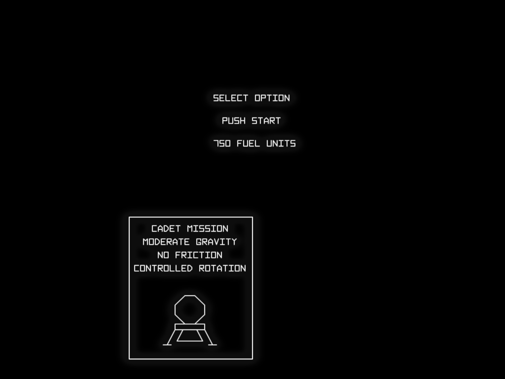
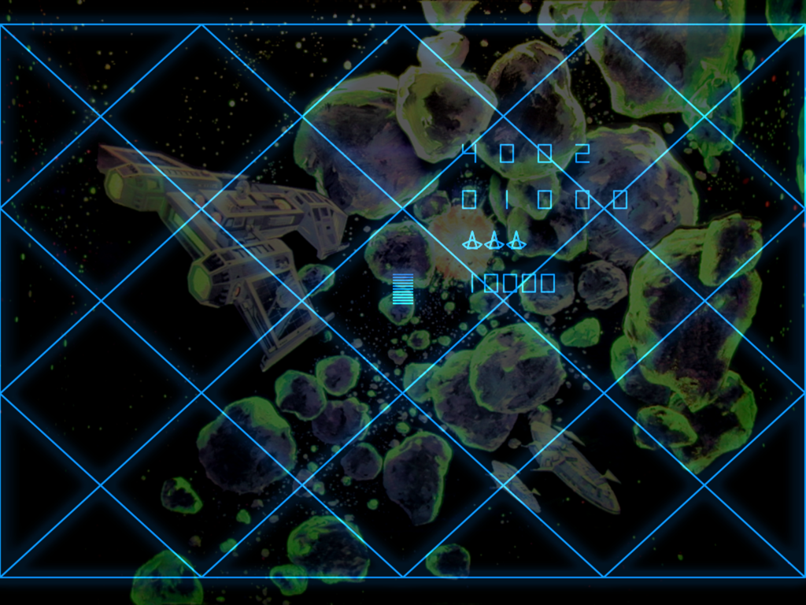
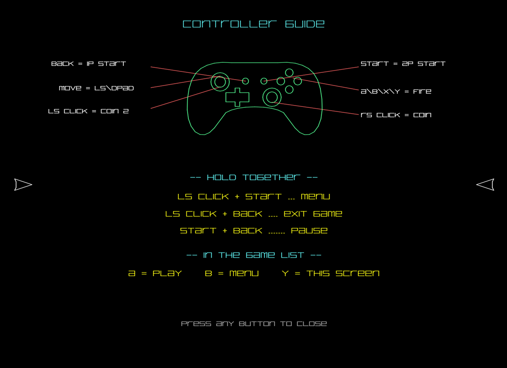
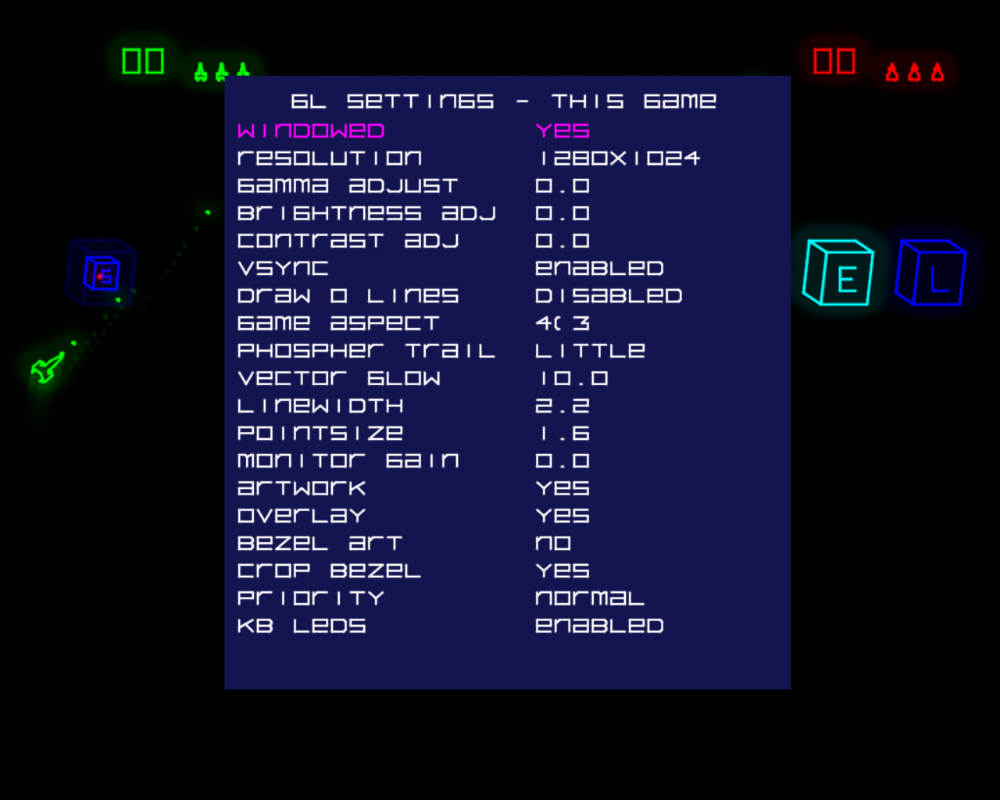

> [!IMPORTANT]
> ⚠️ **On Windows 11, AAE must be run as Administrator** for the LED lights to work correctly.
>
> A July 2026 Windows security update changed the permissions needed to drive the keyboard LEDs,
> which is how AAE lights cabinet start and player lamps. Without elevation the lamps just stay
> dark — everything else runs normally.

<p align="center">
  
</p>

<h1 align="center">AAE — Another Arcade Emulator</h1>

<p align="center">
  A phosphor-accurate emulator for classic <b>vector</b> arcade games — started in 2008,
  dragged back from the grave, and rebuilt from the ground up.
</p>

<p align="center">
  <a href="COPYING"></a>
  
  
  
  
  
</p>

<p align="center">
  
  
</p>
<p align="center">
  
  
</p>

---

> [!WARNING]
> **ROMs are not included.** You must supply your own legally-obtained arcade ROMs.
> AAE uses current **M.A.M.E (TM)** ROM names.

## About

AAE began in **2008** as an unapologetic **M.A.M.E (TM) derivative** — a poorly written fork of
early MAME (0.29 through .90) mixed with code of my own, built solely for my own amusement and
learning, and offered here only as an archival experience. The whole point was to make **vector
arcade games look *right*** — glowing, phosphor-soft beams instead of flat lines. After sitting
untouched for the better part of 17 years, it's back, and it's been rebuilt to surpass my wildest
dreams.

The audio engine, input, frame timing, rendering pipeline, ROM loader, artwork handling, memory
handling, the back-end driver registry — and, one by one, **every CPU core** — have been rewritten
as custom, non-MAME code.

Make no mistake: at its core this is still a MAME derivative, and it stands entirely on the
shoulders of the MAME team's work. **All MAME code used (and abused) in this emulator remains the
copyright of the dedicated people who spend countless hours creating it** — see
[Acknowledgements](#acknowledgements). But the climb from "early-MAME fork" to "a lot of what you see
here is mine now" has been the entire journey.
AAE has been built with a focus on running either in a dedicated arcade cabinet, or on the couch with
a large flatscreen and an Xbox or Playstation controller.

<p align="center">
  
</p>

## What's new in this release

**AAE now runs on Linux.** The emulation core was split out from the video, input and sound
engines, and complete new Linux back-ends were written for all three — **no SDL anywhere**. That gets
AAE onto SteamOS and the Raspberry Pi, with a longer-term target of driving a real vector monitor
from a Teensy or Pi.

**Vulkan is now the default renderer.** The entire OpenGL pipeline was rewritten as Vulkan
equivalents, ported over from my own unreleased game engine. OpenGL 3.3 is still there and still
fully supported — Vulkan is simply what starts by default, and AAE falls back to OpenGL 3.3 on its
own if Vulkan won't initialize.

Everything else, in no particular order:

- **A new glow shader** — a dual-filter pyramid bloom that finally looks better than my original.
  That's subjective, but I like it, and it's the default now. The classic 8-pass blur is still
  selectable. *(I also burned a ton of time on a phosphor-persistence replacement and they were
  all disappointing, so that one is still on the shelf.)*
- **Lunar Lander in-game artwork** — using my own disassembly, a Braze-style ROM patch draws the
  mission and status on screen, so you can tell what you're flying without giving up screen real
  estate to a bezel. Gated behind a dipswitch, on by default. **Absolutely not tested on a real
  PCB** and I doubt it'd survive there without serious tuning.
- **Controllers** — PS5 DualSense and PS4 DualShock 4 are remapped to the standard Xbox layout,
  and the system button chords (menu, exit, pause) work from any gamepad while generic sticks
  can't trigger them by accident. The same combo engine runs on Linux, so Steam Input's virtual
  pads get working chords too.
- **A Controller Guide screen** — a drawn controller showing the button layout, coin/start
  mapping and the chords. It appears once the first time a gamepad is detected, and any time
  after from **Y** in the game list or the CONTROLLER HELP menu entry.


<p align="center">
  
  
</p>
<p align="center">
  
</p>

See [CHANGELOG.txt](CHANGELOG.txt) — the complete revival diary — for everything else.

## Features

- 🟢 **Phosphor vector glow** — bloom, beam falloff and per-vector intensity, tuned to look like
  a real CRT on a modern panel. Dual-filter pyramid by default, classic 8-pass blur optional.
- 🎨 **CRT monitor simulation** — separate colour and monochrome shader chains with shadow mask,
  convergence, halation and scanline controls, plus `.png` scanline overlays for the raster games.
- 🎛️ **Live graphics tuning** — glow, line width, intensity and every monitor knob adjustable
  from the in-game menus, per game.
- 🕹️ **Vector-first accuracy** — vector hardware is the primary focus here and is the most
  carefully emulated.
- 🎮 **Gamepads done properly** — Xbox, DualSense/DualShock 4, Steam Input virtual pads, menu and
  GUI navigation, rumble, system button chords, and an on-screen controller guide.
- 🖱️ **Multi-HID input** — per-device mice *and* keyboards with friendly names and path-stable
  assignments, routed per player. Built for multi-spinner and multi-trackball cabinets.
- 💡 **Cabinet lamp output** — start-button and player lamps driven through the keyboard LEDs.
- 🔊 **Custom multithreaded audio** — XAudio2 on Windows, a native ALSA back-end on Linux with an
  optional PulseAudio path. High-quality resampling, no crackle, no leaks.
- 🖼️ **MAME-style `.lay` artwork** — bezels, overlays and scanlines for the raster games. Vector artwork
  is also rendered via a different system.
- 🗂️ **C++ driver registry** — add or remove a game by adding or removing a single driver, no
  `driver.c` editing required.
- 🧩 **Split core** — the emulation core builds as its own library with no window, sound or input
  dependencies, which is what made the Linux port possible and what a bare-metal vector driver
  will eventually hang off.

<p align="center">
  
</p>

## Platforms and renderers

| Platform | Status | Renderer | How you build it |
|---|---|---|---|
| **Windows 10/11 x64** | Primary | Vulkan (default) or OpenGL | `aae.sln` in Visual Studio 2022 |
| **Windows 7 x64** | Tested | OpenGL | see [Windows 7 build.txt](Windows%207%20build.txt) |
| **SteamOS** (Steam Deck / Steam Machine) | Primary Linux target | Vulkan | Flatpak — `scripts/linux/build-flatpak.sh` |
| **Desktop Linux** (x86_64 / aarch64) | Supported | Vulkan or OpenGL | `scripts/linux/build-linux.sh` |
| **Raspberry Pi 5** (aarch64) | Supported | **Vulkan only** | `scripts/linux/build-pi5.sh` |
| **Raspberry Pi 4** | Untested | Vulkan only, if the driver offers 1.3 | `scripts/linux/build-pi5.sh` |

### Which renderer you get

**Vulkan is the default.** The chain requires **Vulkan 1.3** and rejects anything lower — it is
built on two 1.3 core features, `dynamicRendering` and `synchronization2`, and there is
deliberately no 1.2 fallback path. If Vulkan can't initialise at all, AAE falls back to OpenGL
by itself.

**The OpenGL chain requires OpenGL 3.3** (its shaders are `#version 330 core`). Pick it
explicitly with `renderer=opengl` in `aae.ini`, from the VIDEO SETUP menu, or for a single launch
with `-renderer opengl`.

> **On the Raspberry Pi, Vulkan is not optional.** Mesa's `v3d` driver tops out around GL/GLES
> 3.1, so the OpenGL chain is not a slower fallback there — it's a non-starter. That is the entire
> reason the Vulkan chain exists. `v3dv` reached Vulkan 1.3 on the Pi 5 in the Mesa 24.x era; an
> older image reports 1.2 and AAE will exit with *"no suitable physical device"*. The fix is to
> update Mesa, not to patch AAE.

Pi performance came at a cost, and it's worth being honest about it: the new pyramid glow doesn't
look good on the Pi, the classic shader looks right but is far too expensive to run there, and the
B/W raster shader has to be disabled outright. It runs full speed, and that took three days of
revisions and a lot of concessions.

## Emulated games

**Vector games are the whole reason AAE exists.** Atari and Cinematronics vector classics —
Asteroids & Asteroids Deluxe, Tempest, Major Havoc, Battlezone, Red Baron, Gravitar, Space Duel,
Black Widow, Lunar Lander, Star Wars & The Empire Strikes Back, Aztarac, Cosmic Chasm, Star Castle,
Rip Off, Armor Attack, Warrior, Omega Race, Solar Quest, War of the Worlds, and many more.

### …and a few non-vector games, just for fun

Somewhere along the way the renderer grew a raster path, so a handful of **raster (non-vector)
games came along for the ride** — purely for fun, not the mission. Things like **Warlords,
Galaxian, Galaga, Bosconian, Pac-Man / Ms. / Jr. / Super Pac-Man, Millipede, Centipede,
Missile Command, Mappy, Dig Dug, Rally-X, Gyruss, Phoenix / Pleiads, Xevious** and Space Invaders,
complete with current MAME `.lay` artwork.

<p align="center">
  
</p>

**135 romsets** are supported. The full current list is in
[AAE All Games List.txt](x64/Release/AAE%20All%20Games%20List.txt), or browse it inside the app —
the in-game menu lists everything AAE runs.

## Building

> ROMs and BIOS files are **not** included — supply your own.

Everything in AAE resolves relative to the executable, so on every platform the binary is placed
in **`x64/Release/`**, beside `aae.ini`, `video.ini`, `roms/` and `artwork/`. It has to live with
its data.

### Windows

**Requirements:** **Visual Studio 2022** with the *Desktop development with C++* workload (MSVC
v143 toolset) and the **XAudio2 redistributable** NuGet package
(`Microsoft.XAudio2.Redist`, version **1.2.13**).
[How to install the NuGet package.](https://learn.microsoft.com/en-us/windows/win32/xaudio2/xaudio2-redistributable)

Open **`aae.sln`**, choose **Release | x64**, and build. The executable is produced at
`x64\Release\aae.exe`.

> **Legacy build:** older revisions linked against **Allegro 4** — add the bundled allegro include,
> lib, and dll files (see the project Include and Library folders). This dependency is being phased
> out. See [Build Notes.txt](Build%20Notes.txt) and [Windows 7 build.txt](Windows%207%20build.txt).

### Linux

The build is CMake + a C++17 compiler, and the script checks your prerequisites before it starts
and prints package names for your distro (apt, dnf, pacman or zypper):

```bash
bash scripts/linux/build-linux.sh
```

Add `--check` to run the prerequisite check without building. You'll need a C++ compiler, CMake,
and the **GL, GLEW, X11 and ALSA** development packages — all four are needed to link even for a
Vulkan-only run, because the GL chain is compiled in regardless and simply never called. On
Debian/Ubuntu:

```bash
sudo apt install build-essential cmake libgl1-mesa-dev libglew-dev libx11-dev libasound2-dev libvulkan1 vulkan-tools
```

The Vulkan **loader** is `dlopen`'d at runtime and never linked, and the Vulkan headers are
vendored in the tree, so no Vulkan `-dev` package is needed to build — only `libvulkan.so.1` to
*run* the Vulkan renderer. `glslc` is optional too: SPIR-V is architecture-independent, so the
prebuilt `.spv` files in `x64/Release/shaders/vk` work as-is, and glslc is only needed if you
intend to edit shaders.

Then:

```bash
cd x64/Release && ./aae asteroid
```

If it won't start, the log says why — `x64/Release/systemlog.txt`.

### SteamOS (Steam Deck / Steam Machine)

SteamOS gets a **Flatpak**, and it has to: a binary built on a normal dev box links against that
machine's glibc, which is newer than SteamOS's, so a copied executable dies before `main()`.
Flatpak compiles inside its own SDK, so the result depends only on the runtime.

The manifest and launcher live in [`packaging/flatpak/`](packaging/flatpak). Build a
single-file bundle with:

```bash
bash scripts/linux/build-flatpak.sh
```

That produces `aae.flatpak` in the repo root. On the target:

```bash
flatpak install --user aae.flatpak
```

#### Where the ROMs go on SteamOS

**Launch AAE once.** It creates these two folders for you, in your home directory where you can
actually find them:

```
/home/deck/AAE/roms         <- put your .zip rom sets here
/home/deck/AAE/artwork      <- put your .zip artwork here
```

That's `~/AAE/roms` and `~/AAE/artwork`. In the Steam Deck's file manager (Dolphin, in Desktop
Mode) it's **Home → AAE → roms**. Drop the zips straight in — no renaming, no unzipping, no
rebuilding the Flatpak, and no path to set in `aae.ini`. Restart AAE and the new games appear in
the list.

You can add ROMs with a file manager, or over the network from another machine:

```bash
scp mygame.zip deck@steamdeck.local:~/AAE/roms/
```

A ROM you put there always wins over one shipped inside the bundle with the same name, so a better
dump can simply be dropped on top.

> **Keeping your collection somewhere else** — an SD card, say? Set `mame_rom_path` and
> `mame_artwork_path` in `aae.ini` to an absolute path. The sandbox is already allowed to read
> your home directory and `/run/media` (SD cards, USB). Anywhere else needs one command:
> `flatpak override --user --filesystem=/your/path:ro io.github.tcottrill.AAE`

Settings, high scores, NVRAM, per-game configs and screenshots live separately, in the app's own
data directory. That split is deliberate: `flatpak uninstall --delete-data` resets your settings
and **leaves `~/AAE` and your ROM collection completely alone.**

> The data module packages whatever is sitting in `x64/Release` — including `roms/`, `artwork/`
> and `samples/`. That makes the resulting bundle a private artefact for your own hardware, not
> something to hand out. It's a separate module precisely so it's obvious what comes out first.

### Raspberry Pi 5

Build **on the Pi** — natively, not cross-compiled and not copied from another machine:

```bash
bash scripts/linux/build-pi5.sh
```

`--check` runs the prerequisite check alone, and `--with-tools` also builds `aae_inputtest`. The
script treats **Vulkan 1.3 as a hard requirement** and tells you exactly which check failed,
because on this hardware a missing 1.3 means no working renderer at all — see
[the renderer note above](#which-renderer-you-get).

Raspberry Pi 4 is not something I've tested. The same script should work if your Mesa reports
Vulkan 1.3; if it reports 1.2, it won't run.

### Developer tools

Three extra CMake targets, none of them built by default:

| Target | What it's for |
|---|---|
| `aae_headless` | Runs the emulation core with no window, sound or input — used to verify emulation output matches across platforms. |
| `aae_inputtest` | Prints every input state change. `--leds` walks the lamp sequence so you can answer "do the LEDs work here" without launching a game. |
| `aae_audiotest` | Audio back-end exercise. Requires ALSA headers. |

## Running

| | |
|---|---|
| Launch a game directly | `aae asteroid` |
| Force a renderer for one launch | `aae asteroid -renderer opengl` |
| Release the mouse | **F9** (click to recapture) |
| Controller guide | **Y** in the game list, or the CONTROLLER HELP menu entry |
| Everything else | `aae.ini`, or the in-game menus |

Cabinet lamp output needs a little help from the OS: on **Windows 11**, since the July 2026
security updates, **AAE has to run as Administrator** for the keyboard LEDs to work — see the note
at the top of this page. On **Linux** your user may need to be in the `input` group.

## Documentation

- [AAE Command Line Options.txt](AAE%20Command%20Line%20Options.txt)
- [AAE Configuration Options.txt](AAE%20Configuration%20Options.txt)
- [AAE Xbox Controller Guide.txt](AAE%20Xbox%20Controller%20Guide.txt)
- [RENDERING_TUNING.md](RENDERING_TUNING.md) — the graphics knobs and what they do
- [CHANGELOG.txt](CHANGELOG.txt) — the complete revival diary
- [Build Notes.txt](Build%20Notes.txt) · [Windows 7 build.txt](Windows%207%20build.txt)

## Acknowledgements

- **The M.A.M.E (TM) Team** — AAE is based on early MAME (0.29–.90), and all MAME code used in this
  project **remains the copyright of the MAME team and the original authors**. I thank everyone who
  has worked on MAME and I am in awe of all that they have created.
- **Aaron Giles** — the Cinematronics `ccpu` core: the one MAME CPU core kept on purpose, because
  it is a work of art.
- **CPU & sound lineage** — John Butler's 6809 (since replaced by a clean-room core), the Musashi
  68000 (wrapped, now being phased out for a clean-room 68000), Mike Chambers' 8080 (base for the
  8085A core), and MAME sound references for the AY-3-8910, POKEY, and TMS36xx.
- **Clay Cowgill** — homebrew vector games (Tempest Tubes, Battlezone Plus, and more).
- Recent work was assisted by **Claude Code, ChatGPT, and Gemini**.

## Contributors

- **[Tim Cottrill](https://github.com/tcottrill)** ([@tcottrill](https://github.com/tcottrill)) — author & maintainer.
- **Claude Code** (Anthropic — Claude Opus 4.8) — branding & docs.

## License

AAE is licensed under the **GNU General Public License v3.0** — see [COPYING](COPYING).

The GPL covers **AAE's own source only**. It grants no rights to any arcade BIOS or game ROMs, and
it does not cover the **MAME-derived portions** of the code, which remain the copyright of the MAME
team and the original authors. You are responsible for the legality of any ROM images you use.

*This is an independent, non-commercial, archival project and is not affiliated with or endorsed by
any rights holder. MAME is a trademark of its respective owners.*
